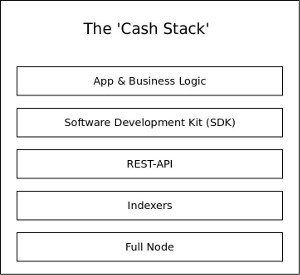
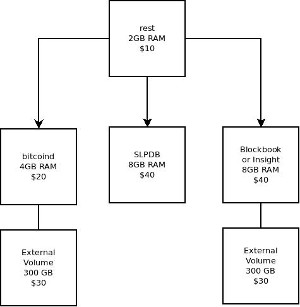

# Cash Stack Benchmark Tests

## Purpose and Scope
The purpose of this document is to describe a protocol for benchmarking and testing [the BCH full stack of software](https://troutsblog.com/research/bitcoin-cash/how-to-bch-full-stack-developer), the system-as-a-whole. The scope of the work is to assemble a collection of standardized virtual private servers (VPS) and run a standardized command line application against that collection. The deliverable is test data that can be compared to previous and future results, in order to accurately price cloud services.

There are many implementation of each layer of the Cash Stack. For example, all the following full nodes implementations can be used for the full node layer:

- [Bitcoin ABC](https://www.bitcoinabc.org/)
- [Bitcoin Unlimited](https://www.bitcoinunlimited.info/download)
- [BCHD](https://bchd.cash/)
- [Flowee the Hub](https://flowee.org/)
- [Bitcoin Verde](https://github.com/SoftwareVerde/bitcoin-verde)

There are many implementation of indexers. Some are general purpose, and some are specific to a use case (like SLP tokens). A few examples of the indexer layer include:

- [Blockbook](https://troutsblog.com/research/bitcoin-cash/blockbook)
- [Bitcore Node](https://troutsblog.com/research/bitcoin-cash/bitcore-node-insight-api)
- [Flowee Indexer](https://flowee.org/)
- [BCHD](https://bchd.cash/) (includes indexing capabilities)
- [SLPDB](https://github.com/simpleledger/SLPDB)

The benchmark tests in this repository allow comparison between systems using different implementations.

## Test System
The diagram below illustrates the wiring of the benchmarking system. Using Digital Ocean, the cost of the system is $170 per month. The goal is to be able to serve between 10 to 1000 requests per second with this system, and throughput around that range will be tested.

Benchmarking System - $170 per month using Digital Ocean

An advantage of breaking up the test system into discrete ‘blocks’ is that it allows isolated study of each of the system’s subcomponents. It allows identification and characterization of bottlenecks as they form at different levels of throughput.

The final product will probably be operated using Kubernetes to more efficiently use computing resources, but the auto-managed capability of Kubernetes is not advantageous for isolating and studying bottlenecks.

## Test Protocol
As can be seen in Appendix 2, an ideal wallet will generate 12 API requests when sending an SLP token. Real world wallet requests can be significantly higher. The ideal wallet in the appendix has 1 token UTXO and 1 BCH UTXO. It sends the token to itself.

Because the wallet is so simple and generating the transaction is simple, easy to reproduce, and easy to stage, it makes a good blueprint for a standardized test. A series of public addresses can be staged and scaled in order to simulate real-world conditions, patterns, and throughput.

## The Basic Math
- 5 minutes = 300 seconds.
- 1 token send = 12 requests
- Need to set up 300 public addresses. Make one token send per second to generate sustained 12 rps.

## CLI app commands
- `create-wallet` - create a series of BCH wallets. The first wallet should be loaded with BCH. A second wallet should be created and loaded with tokens. Finally a third uut (unit under test) wallet should be created, which will be the one used in the actual test.

- `fund-test-wallet` - Send 300 utxos containing 2000 sats (0.006 BCH total) to the first 300 addresses in the test-wallet. Long-running process. Will run until it succeeds.
This command has been created with automatic retry logic. Approximately 4 minutes between transactions are used to avoid failure due to the 25-tx limit and other network issues.

- `tokenize-test-wallet` - Send 1 SLP token to each of the 300 test addresses. Long-running process. Will run until it succeeds.
This command has been created with automatic retry logic. Approximately 4 minutes between transactions are used to avoid failure due to the 25-tx limit and other network issues.

`run-test` - each wallet sends its token back to itself. It generates a send once per second by default, but the timing is adjustable via constant variables at the top of the code.

`send-all` - send all BCH to clean up the test wallet and consolidate funds back in the master wallet. Use the -i flag to ignore tokens and spend their dust UTXOs, effectively burning the tokens.

## Deviations From Reality
The reality is that BCH transactions are messy. Here are a few real-world considerations that complicate this kind of test:

- It’s not uncommon for an hour to pass without a block confirmation. This makes it difficult to stage a test wallet without running into the unconfirmed 25-tx limit.

- High or low network transaction volume will skew results. If the test is run during low network usage, the results will be skewed in favor of performance of the system. If run during high network usage, the results will be skewed against performance.

- Most transactions rely on UTXO data retrieved from an indexer. It takes time for indexers to update their database, so there is always a period of time after each transaction where UTXOs in the indexer are invalid relative to the blockchain. This is why the test wallet is ‘staged’ with UTXOs, and does not accurately reflect the behavior of ‘power’ users who rapidly use child UTXOs in a short period of time.

# Appendix 1 - Example SLP token transaction

Below is the output of a wallet managed by slp-cli-wallet. It contains an ideal balance of 1 token UTXO and one non-token UTXO. The transaction includes sending a token from the wallet to an address.

./bin/run send-tokens -n temp -q 20 -a simpleledger:qqwnssxngyzkz77lh0vvggek48rmm40t6vum2jw7sn -t 497291b8a1dfe69c8daea50677a3d31a5ef0e9484d8bebb610dac64bbc202fb7

Existing balance: 0.00010546 BCH
debug: walletInfo.nextAddress = 6
Getting address data at index 0 up to index 20
Getting address data at index 20 up to index 40

SLP Token Summary:
Ticker Balance TokenID
TOK-CH 20 497291b8a1dfe69c8daea50677a3d31a5ef0e9484d8bebb610dac64bbc202fb7

TXID: 20bab2096ed950c14f47d28fa114394d4f65671fea08c2a68206df79d6dc8398
View on the block explorer: https://explorer.bitcoin.com/bch/tx/20bab2096ed950c14f47d28fa114394d4f65671fea08c2a68206df79d6dc8398

The above transaction generated the following API calls when sending a single token:
::ffff:127.0.0.1 - POST /v3/blockbook/balance 200 500.559 ms - 4447 axios/0.19.0
::ffff:127.0.0.1 - POST /v3/slp/balancesForAddress 200 2095.747 ms - 261 axios/0.19.0
::ffff:127.0.0.1 - GET /v3/blockbook/utxos/bitcoincash:qpzwmx5t8gh72vtnj6jkr4q0eatp5n0dtqcl9danc2 200 319.715 ms - 151 axios/0.19.0
::ffff:127.0.0.1 - POST /v3/slp/validateTxid 200 744.846 ms - 90 axios/0.19.0
::ffff:127.0.0.1 - GET /v3/rawtransactions/getRawTransaction/35750cb68b4063f8e0fe8d41d571efe67aa3411d3df98a3b0fca86844c17acc8?verbose=true 200 216.192 ms - 3683 axios/0.19.0
::ffff:127.0.0.1 - GET /v3/rawtransactions/getRawTransaction/497291b8a1dfe69c8daea50677a3d31a5ef0e9484d8bebb610dac64bbc202fb7?verbose=true 200 220.132 ms - 2364 axios/0.19.0
::ffff:127.0.0.1 - POST /v3/blockbook/balance 200 556.909 ms - 4281 axios/0.19.0
::ffff:127.0.0.1 - POST /v3/slp/balancesForAddress 200 1086.352 ms - 61 axios/0.19.0
::ffff:127.0.0.1 - GET /v3/blockbook/utxos/bitcoincash:qz0ts8qlldfhq5nhdu7mamy6qv6s7djfnyk9hfvwa0 200 484.426 ms - 155 axios/0.19.0
::ffff:127.0.0.1 - GET /v3/blockbook/utxos/bitcoincash:qpzwmx5t8gh72vtnj6jkr4q0eatp5n0dtqcl9danc2 200 510.438 ms - 151 axios/0.19.0
::ffff:127.0.0.1 - GET /v3/blockchain/getTxOut/a1e43bc7e1a107177a9e82fb41de0ffef4deea2e274f31f643286d14dc847753/0?include_mempool=true 200 304.750 ms - 405 axios/0.19.0
::ffff:127.0.0.1 - POST /v3/rawtransactions/sendRawTransaction 200 223.042 ms - 68 axios/0.19.0

### Conclusion
A single ‘action’ such as sending a token resulted in 12 API calls to the REST API. This is an idealized wallet; real-world wallets may make significantly more API calls.

# Appendix 2 - Typical day in the life of rest.bitcoin.com

## High Level Summary
log file entries processed: 827282
Start date: 12/17/2019, 5:53:10 AM, End date: 12/17/2019, 10:29:00 PM
Logs span 0.6915517013888889 days
Number of invalid requests processed: 4359
Number of valid requests processed: 779204
Estimated requests per day: 1126747.282141123

Endpoint Report:
Filtered and sorted endpoints:
GET /solr,11
POST /v2/rawtransactions/decodeRawTransaction,11
GET /v2/util/validateAddress,69
GET /v2/slp,81
GET /v2/rawtransactions/sendRawTransaction,123
GET /v2/block/detailsByHash,144
GET /v2/address/transactions/13we8WJoF1WNf2HEpbyiUPPWXVC8cD5SMA,176
GET /v2/mining,192
GET /v2/address/transactions/1Dvv8zS6VNr71CgkYCXYmp67YuWPFdMmNX,194
GET /v2/address/transactions/1LCgG3aeJLR4yQDTzeXbnGs9nmC97MxVBJ,200
GET /v2/address/unconfirmed,212
POST /v2/slp/transactions,261
GET /v2/slp/convert,530
GET /v2/slp/balancesForToken,661
GET /v2/cashAccounts/reverselookup,992
GET /v2/block/detailsByHeight,9292
GET /v2/slp/list,9580
GET /v2/slp/balancesForAddress,9865
POST /v2/address/transactions,11920
POST /v2/rawtransactions,29554
GET /v2/rawtransactions/getRawTransaction,31911
POST /v2/address/details,43421
POST /v2/slp/validateTxid,53881
GET /v2/slp/txDetails,84385
GET /v2/slp/balance,84840
POST /v2/transaction/details,86413
GET /v2/blockchain,109906
GET /v2/address/utxo,209285

The endpoint report above follows this format:
HTTP call - endpoint - requests during the ‘log span’
