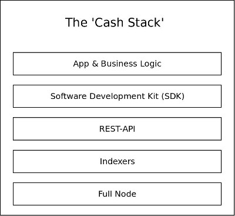
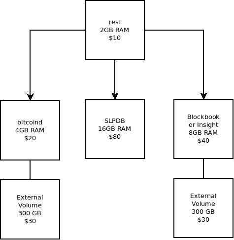

# Cash Stack Benchmark Tests

## Purpose and Scope
The purpose of this document is to describe a protocol for benchmarking and testing [the BCH full stack of software](https://troutsblog.com/research/bitcoin-cash/how-to-bch-full-stack-developer), the system-as-a-whole. The scope of the work is to assemble a collection of standardized virtual private servers (VPS) and run a standardized command line application against that collection. The deliverable is test data that can be compared to previous and future results, in order to accurately price cloud services.

There are many implementation of each layer of the Cash Stack. For example, all the following full nodes implementations can be used for the full node layer:

- [Bitcoin ABC](https://www.bitcoinabc.org/)
- [Bitcoin Unlimited](https://www.bitcoinunlimited.info/download)
- [BCHD](https://bchd.cash/)
- [Flowee the Hub](https://flowee.org/)
- [Bitcoin Verde](https://github.com/SoftwareVerde/bitcoin-verde)

There are many implementation of indexers. Some are general purpose, and some are specific to a use case (like SLP tokens). A few examples of the indexer layer include:

- [Blockbook](https://troutsblog.com/research/bitcoin-cash/blockbook)
- [Bitcore Node](https://troutsblog.com/research/bitcoin-cash/bitcore-node-insight-api)
- [Flowee Indexer](https://flowee.org/)
- [BCHD](https://bchd.cash/) (includes indexing capabilities)
- [SLPDB](https://github.com/simpleledger/SLPDB)

The benchmark tests in this repository allow comparison between systems using different implementations.

## Test System
The diagram below illustrates the wiring of the benchmarking system. Using Digital Ocean, the cost of the system is $170 per month. The goal is to be able to serve between 10 to 1000 requests per second with this system, and throughput around that range will be tested.

Benchmarking System - $170 per month using Digital Ocean

An advantage of breaking up the test system into discrete ‘blocks’ is that it allows isolated study of each of the system’s subcomponents. It allows identification and characterization of bottlenecks as they form at different levels of throughput.

The final product will probably be operated using Kubernetes to more efficiently use computing resources, but the auto-managed capability of Kubernetes is not advantageous for isolating and studying bottlenecks as the discrete system is, illustrated above.

## Test Protocol
As can be seen in [Appendix 1](./apdx1-example-slp-token-transaction.md), an ideal wallet will generate 12 API requests when sending an SLP token. Real world wallet requests can be significantly higher. The ideal wallet in the appendix has 1 token UTXO and 1 BCH UTXO. It sends the token to itself.

Because the wallet is so simple and generating the transaction is simple, easy to reproduce, and easy to stage, it makes a good blueprint for a standardized test. A series of public addresses can be staged and scaled in order to simulate real-world conditions, patterns, and throughput.

### The Basic Math
- 5 minutes = 300 seconds.
- 1 token send = 12 requests
- Need to set up 300 public addresses. Make one token send per second to generate sustained 12 requests per second (rps) or 1 transaction per second (tps).

## Deviations From Reality
The reality is that BCH transactions are messy. Here are a few real-world considerations that complicate this kind of test:

- While these benchmarks can be run on either testnet or mainnet, mainnet is encouraged. Testnet is a strange place and rarely reflects the real-world network performance of mainnet. Development is encouraged for testnet, but real-world testing data should be generated from mainnet.

- It’s not uncommon for an hour to pass without a block confirmation. This makes it difficult to stage a test wallet without running into the unconfirmed 25-tx limit.

- High or low network transaction volume will skew results. If the test is run during low network usage, the results will be skewed in favor of performance of the system. If run during high network usage, the results will be skewed against performance. For this reason, the daily transaction volume, averaged over the last 7 days, should be noted before executing a benchmark test.

- Most transactions rely on UTXO data retrieved from an indexer. It takes time for indexers to update their database, so there is always a period of time after each transaction where UTXOs in the indexer are invalid relative to the blockchain. This is why the test wallet for some tests are ‘staged’ with UTXOs, and does not accurately reflect the behavior of ‘power’ users who rapidly use child UTXOs in a short period of time.

## Variations of Tests
While all benchmark tests in this repository test the system-as-a-whole, there are variations of the basic test that focus on specific sub-components:

- [`node-test`](./test01-node.md) is a variation of the test protocol that focuses on the full nodes ability to receive and broadcast transactions to the network. This does not stress the indexer layer because only confirmed UTXOs are used. This variation is defined by the following qualities:
  - SLPDB is ignored and tokens are not used.
  - A wallet is staged with utxos that have all been confirmed in blocks prior to running the test.
  - No child-utxos are spent. Only staged utxos.

- `indexer-test` generates a series of transactions that spend child-utxos. This test measures the time it takes for an indexer to update its database to reflect the changing state of UTXOs. This variation has following qualities:
  - SLPDB is ignored and tokens are not used.
  - A wallet is staged with 10 UTXOs that have been confirmed in blocks.
  - Each UTXO is spent and its child UTXO spent, up to 20 times.
  - After a UTXO has generated 20 children, the next staged UTXO is used.
  - A full node confirms the validity of the UTXO before a TX is broadcast. If invalid, the TX is aborted and tried again.
  - The wallet repeatedly tries to spend the same UTXO until it succeeds.
  - The time between each successful TX is measured and averaged across the 200 TXs.

- `staged-token-test` is similar to the *node-test* but includes the sending of an SLP token. This test forces an SLP indexer to rapidly update its database for a specific token. It's a test of the indexers ability to process sustained and rapid SLP transactions over a period of time.

- `unstaged-token-test` is similar to the *indexer-test* but includes the sending of an SLP token. It tests the average time for an SLP indexer to analyze incoming transactions and update its database.

## CLI app commands
- `create-wallet` - create a series of BCH wallets. The first wallet should be loaded with BCH. A second wallet should be created and loaded with tokens. Finally a third uut (unit under test) wallet should be created, which will be the one used in the actual test.

- `fund-test-wallet` - Send 300 utxos containing 2000 sats (0.006 BCH total) to the first 300 addresses in the test-wallet. Long-running process. Will run until it succeeds.
This command has been created with automatic retry logic. Approximately 4 minutes between transactions are used to avoid failure due to the 25-tx limit and other network issues.

- `tokenize-test-wallet` - Send 1 SLP token to each of the 300 test addresses. Long-running process. Will run until it succeeds.
This command has been created with automatic retry logic. Approximately 4 minutes between transactions are used to avoid failure due to the 25-tx limit and other network issues.

`run-test` - each wallet sends its token back to itself. It generates a send once per second by default, but the timing is adjustable via constant variables at the top of the code.

`send-all` - send all BCH to clean up the test wallet and consolidate funds back in the master wallet. Use the -i flag to ignore tokens and spend their dust UTXOs, effectively burning the tokens.
